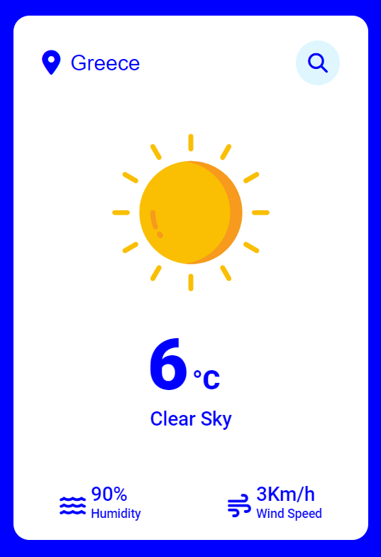
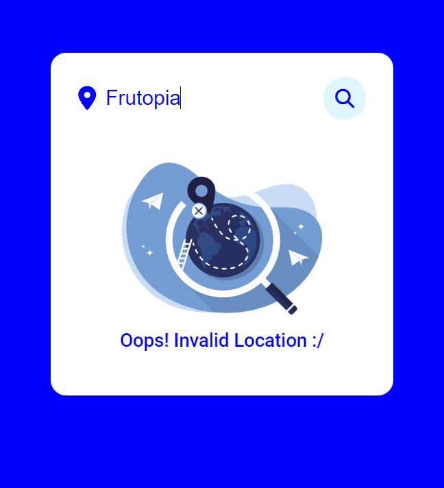

# Weather App
April 2024
Styliani Kalaitzaki

## Description
The Weather App is a web application that provides users with real-time weather information based on their location input. Users can enter their location in the search box, triggering an event that fetches weather data such as temperature, humidity, and wind speed from the OpenWeatherMap API. The app dynamically updates the interface to display the current weather conditions, including a visual representation of the weather state.

## Features
- Fetches real-time weather data using the OpenWeatherMap API.
- Displays temperature, humidity, and wind speed for the specified location.
- Supports visual representations of weather conditions, including icons for clear skies, clouds, rain, snow, and haze.
- Gracefully handles invalid location inputs by displaying a custom error message.

## Technologies Used
- HTML5
- CSS3
- JavaScript (ES6+)
- OpenWeatherMap API

## Usage
1. Enter your location in the search box.
2. Press the search button or hit Enter to fetch weather data.
3. View the current weather conditions displayed on the screen.

## Screenshots

## Acknowledgements
- [OpenWeatherMap API](https://openweathermap.org/api) - For providing weather data.
